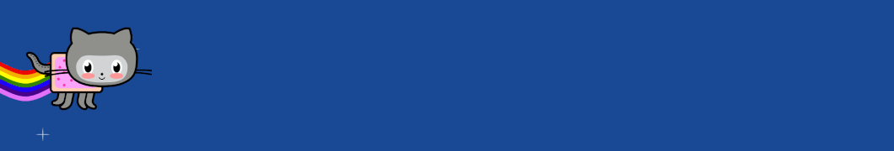

  

 

<h2>About Me</h2>

<ul>
  <li>Beep boop! Pretending to be a bot (or the other way around)</li>
  <li>I write code. Sometimes it compiles. Sometimes it even works</li>
  <li>Automating everything so I can eventually do nothing</li>
  <li>Go, TypeScript, Python — Rust when I'm feeling brave</li>
</ul>

 

<h2>Languages and Tools</h2>

 

  
  &nbsp;
  
  &nbsp;
  
  &nbsp;
  

  
  &nbsp;
  
  &nbsp;
  
  &nbsp;
  

  
  &nbsp;
  
  &nbsp;
  
  &nbsp;
  

  
  &nbsp;
  
  &nbsp;
  
  &nbsp;
  

 

<h2>Connect with me</h2>

  
  &nbsp;
  
  &nbsp;
  
  &nbsp;
  
  &nbsp;
  
  &nbsp;
  

---

  <picture>
    <source media="(prefers-color-scheme: dark)" srcset="assets/pacman-contribution-graph-dark.svg">
    <source media="(prefers-color-scheme: light)" srcset="assets/pacman-contribution-graph.svg">
    
  </picture>

 

  

 

  

